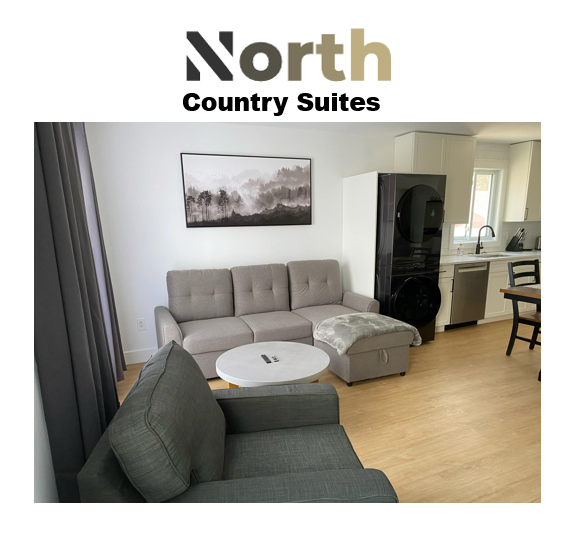
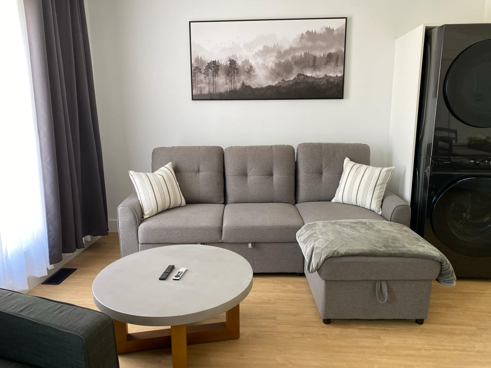
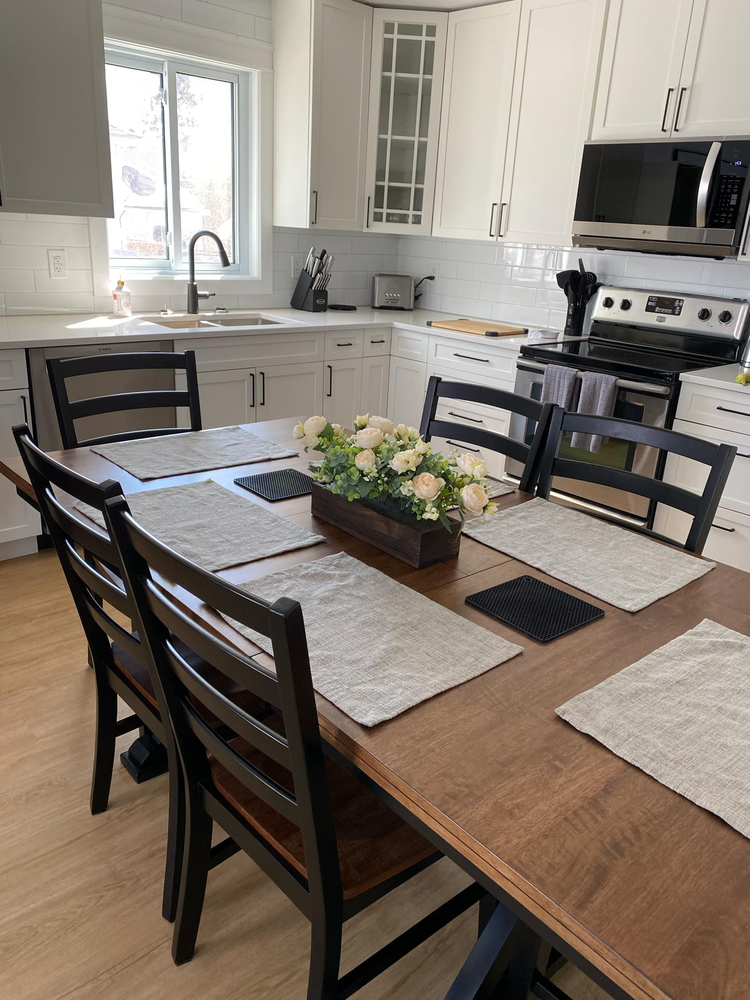
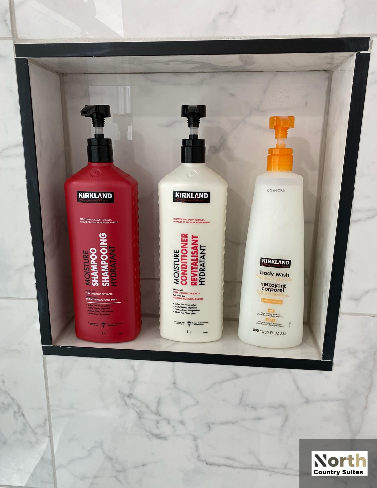
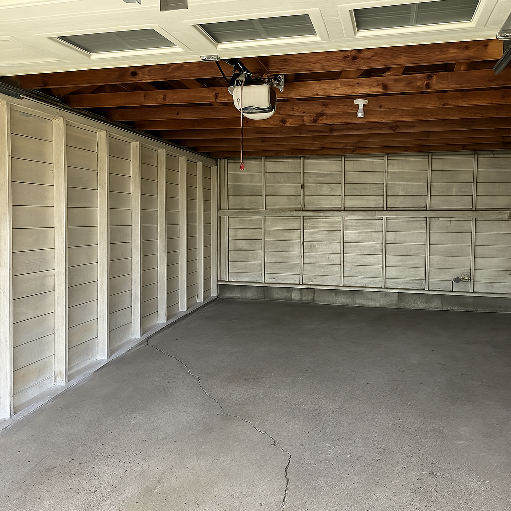
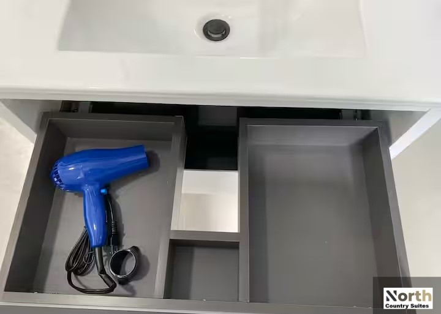
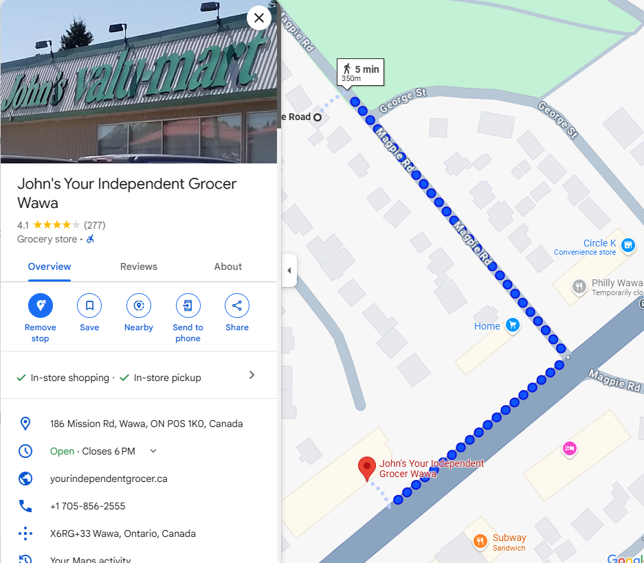

  

# New - Modern - Immaculate - Luxury

Enjoy a modern and clean experience at this centrally located home. The entire home is yours. Located across from a large park/playground and only steps to the grocery store and local beach. This Wawa Ontario location of North Country Suites is newly renovated with all new furnishings and luxury bedding. Long, double wide driveway can fit your trailer. Fast WIFI and TV with hundreds of channels, free movies, on demand TV shows, and premium sports. Gaming console with 20,000 games. Self check in.

---

## The Property

Every single surface and material in this house is new! This house has 2 bedrooms, each with a queen size bed as well as a pull out couch to sleep 6 people in total. All rooms are on the same floor.

## Living Room

All new furnishings, Pull out couch sleeps 2. Luxury linens stored in the lounge section. 65" 4k smart TV with cable television with premium sports subscriptions, all streaming services you can think of. Thousands of movies, and TV shows on demand. Retro video game console with 20,000+ games. 100Mbps Wifi.

<table>
  <tr>
    <td></td>
    <td></td>
    <td></td>
  </tr>
</table>

## Dining Room

The dining room includes a table that seats six with plenty of place settings for everyone.

<table>
  <tr>
    <td></td>
    <td></td>
    <td></td>
  </tr>
</table>

## Kitchen

All new cookware, bakeware, dinnerware, flatware, chopsticks, wine glasses. New microwave, fridge, stove, toaster. All quartz countertops. Coffee (Keurig) and tea area and comes stocked with free coffee (6) and tea (6). 

<table>
  <tr>
    <td></td>
    <td></td>
    <td></td>
  </tr>
</table>

## Bedroom #1

New queen size beds with new Sealy Posturepedic Bloomfield Eurotop Queen mattresses. All linens are new and hotel quality. Each nightstand has convenient USB A and USB C connections available. A dresser and mirror are available for use. Closet with plenty of hangers.
<table>
  <tr>
    <td></td>
    <td></td>
    <td></td>
  </tr>
</table>

## Bedroom #2

New queen size beds with new Sealy Posturepedic Bloomfield Eurotop Queen mattresses. All linens are new and hotel quality. Each nightstand has convenient USB A and USB C connections available. A dresser and mirror are available for use. Closet with plenty of hangers.
<table>
  <tr>
    <td></td>
    <td></td>
    <td></td>
  </tr>
</table>

## Bathroom

Floating vanity. New tub with glass shower doors. Shampoo, conditioner, and body wash are provided.
<table>
  <tr>
    <td></td>
    <td></td>
    <td></td>
  </tr>
</table>

## Laundry
This home has a new dishwasher (with free detergent tabs), and new stackable laundry available (with free pods and dryer sheets). 

<table>
  <tr>
    <td></td>
  </tr>
</table>

## Garage

The property has a large garage that can be used to store your motorcycle / snowmobile / kayaks / bikes etc.
<table>
  <tr>
    <td></td>
  </tr>
</table>

## Exterior
A large gas barbeque and outdoor seating is available for guest use on the deck behind the house. Large backyard available for use.
<table>
  <tr>
    <td></td>
    <td></td>
    <td></td>
  </tr>
</table>

## Parking

Ample free parking on the property. Double wide driveway is long enough to store your truck and trailer.

<table>
  <tr>
    <td></td>
  </tr>
</table>

## Extras

Iron and ironing board as well as hair dryer available.

<table>
  <tr>
    <td></td>
  </tr>
</table>

## House Floorplan

<table>
  <tr>
    <td></td>
    <td></td>
  </tr>
</table>

## Neighborhood

Central location, walking distance to everywhere is Wawa. Grocery store is a 5 minute walk. Convenience store is a 2 minute walk. Beach access at Wawa lake is walking distance. Park with a playground is right across the street. Ride your snowmobiles and ATVs right from the property to the trails.

<table>
  <tr>
    <td></td>
  </tr>
</table>

## Recommendations

Judith lives in the neighborhood and is familiar with local businesses and activates. The in-house guestbook includes a list of recommended restaurants and bars. If something is not covered in the guestbook, please message the host for additional guidance.

## Safety

Smoke alarm, Carbon monoxide alarm, Fire extinguisher, First aid kit

---

---

## Location

We are conveniently located at:
76 Magpie Rd
Wawa, Ontario, Canada

[Location of North Country Suites - Wawa on Google Maps](https://www.google.com/maps/place/76+Magpie+Rd,+Wawa,+ON+P0S+1K0,+Canada/@47.9918374,-84.7768903,1029m/data=!3m1!1e3!4m10!3m9!1s0x4d470af82db87349:0xa8de7f6b035417e2!5m3!1s2025-07-23!4m1!1i2!8m2!3d47.9920378!4d-84.775211!16s%2Fg%2F11c11bty88?authuser=0&entry=ttu&g_ep=EgoyMDI1MDUyMS4wIKXMDSoASAFQAw%3D%3D)

---

## Booking & Contact Information

Ready to book your stay or have questions?

* **Email:** `judyilewis100@gmail.com`
* **Book Direct via email and save 5% over booking on Airbnb/VRBO/Booking.com**
* **Booking Platforms:**
    * [Airbnb link for North Country Suites - Wawa](https://www.airbnb.ca/rooms/1393689387325093203?source_impression_id=p3_1748196683_P38Riavgy1eCztkR)
    * [VRBO link for North Country Suites - Wawa](https://www.vrbo.com/en-ca/cottage-rental/p20133780?dateless=true)
    * [Booking.com link for North Country Suites - Wawa](https://www.booking.com/hotel/ca/newly-renovated-luxury.html)

We look forward to welcoming you to North Country Suites - Wawa!

---

